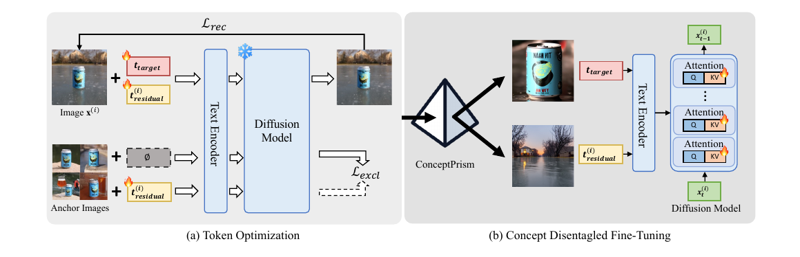

# ConceptPrism: Concept Disentanglement in Personalized Diffusion Models via Residual Token Optimization

[](https://arxiv.org/abs/2602.19575)

Official PyTorch implementation of our **CVPR 2026** paper.

> Minseo Kim, Minchan Kwon, Dongyeun Lee, Yunho Jeon, Junmo Kim. *ConceptPrism: Concept Disentanglement in Personalized Diffusion Models via Residual Token Optimization*. CVPR 2026. [[arXiv]](https://arxiv.org/abs/2602.19575)



ConceptPrism extracts a personalized concept from a few reference images by jointly optimizing a single **target token** and image-specific **residual tokens**. A reconstruction loss anchors the prompt-image correspondence; an exclusion loss empties the residual tokens of any shared concept, forcing the target token to absorb it. After token optimization, a short LoRA fine-tuning stage cements the concept into the diffusion model. No segmentation masks, class nouns, or auxiliary encoders are required.

## Setup

Tested with **Python 3.10**, **PyTorch 2.4**, **CUDA 12.1** inside an `nvcr.io/nvidia/pytorch:24.05-py3` Docker container on a single NVIDIA RTX 3090.

```bash
git clone <this-repo>.git && cd conceptprism
pip install -r requirements.txt
pip install -e .
accelerate config default
```

For FLUX in 4-bit (24 GB GPUs), `bitsandbytes` is already in `requirements.txt`. For new-concept caption generation (`scripts/generate_init_prompts.py`) you also need `GEMINI_API_KEY` set.

## Stable Diffusion v2.1

End-to-end (Stage 1 → Stage 2 → DreamBench inference) for one concept:

```bash
bash scripts/train_sd21.sh dog
```

A single prompt:

```bash
python infer_sd21.py \
    --learned_embeddings_path runs/sd21/dog/stage1/learned_embeddings.pt \
    --lora_weights_path runs/sd21/dog/stage2 \
    --instance_data_dir datasets/dog \
    --prompt "A * sleeping in the snow" \
    --output_dir runs/sd21/dog/single
```

## FLUX.1

Default (bf16, ≥40 GB GPU):

```bash
bash scripts/train_flux.sh dog
```

Low-VRAM (4-bit + CPU offload, fits on 24 GB):

```bash
USE_4BIT=1 bash scripts/train_flux.sh dog
```

## Datasets

A handful of demo concepts (objects, live subjects, and abstract styles) are bundled under `datasets/`. See [`datasets/README.md`](datasets/README.md) for image attribution and instructions on adding new concepts.

## Citation

```bibtex
@inproceedings{kim2026conceptprism,
  title     = {ConceptPrism: Concept Disentanglement in Personalized Diffusion Models via Residual Token Optimization},
  author    = {Kim, Minseo and Kwon, Minchan and Lee, Dongyeun and Jeon, Yunho and Kim, Junmo},
  booktitle = {Proceedings of the IEEE/CVF Conference on Computer Vision and Pattern Recognition (CVPR)},
  year      = {2026}
}
```
